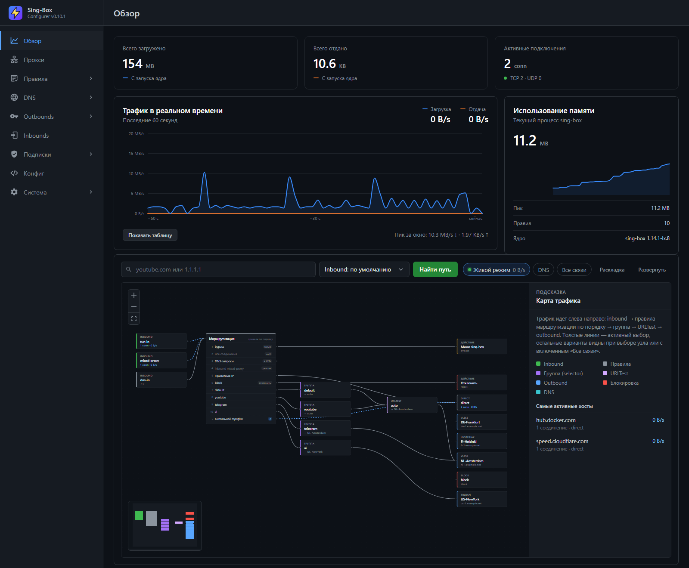

# Sing-Box Конфигуратор

Веб-приложение на Go и Vue 3 для управления sing-box: правилами маршрутизации, группами, DNS, outbound-ами,
inbound-ами, подписками и профилями устройств сети.



## Установка

Конфигуратор ставится на Linux-сервер или роутер (amd64, arm64, armv7) вместе с sing-box
([sing-box-lx](https://github.com/lanfix/sing-box-lx) — сборка форка [Leadaxe/sing-box-lx](https://github.com/Leadaxe/sing-box-lx)
с поддержкой AmneziaWG и правил по MAC-адресам устройств) одной командой. Типовая схема — сервер в локальной сети
как шлюз и DNS для устройств: [docs/typical-use.md](docs/typical-use.md).
Есть два варианта с одинаковыми возможностями, включая обновление конфигуратора из интерфейса:

- **[Docker](docs/install-docker.md)** — sing-box и конфигуратор в контейнерах docker compose:

  ```bash
  curl -fsSL https://raw.githubusercontent.com/lanfix/sing-box-configurer/master/install-docker.sh | sudo bash
  ```

- **[systemd](docs/install-systemd.md)** — без Docker, оба работают службами systemd:

  ```bash
  curl -fsSL https://raw.githubusercontent.com/lanfix/sing-box-configurer/master/install-systemd.sh | sudo bash
  ```

Параметры скриптов (логин и пароль панели, порт, версии), требования, расположение файлов, обновление
и удаление — в документации по ссылкам. sing-box принимает DNS-запросы на порту 53: если его занимает
DNS-заглушка systemd-resolved, скрипты ее отключают.

После установки откройте `http://<адрес-сервера>:8080`, задайте логин и пароль в «Система → Безопасность →
Доступ к панели», настройте группы, DNS и серверы и примените конфиг на странице «Конфиг».

## Доступ к панели

Пока вход не включен, панелью и sing-box может управлять любой, у кого есть сетевой доступ к порту 8080.
Логин и пароль задаются в «Система → Безопасность → Доступ к панели»; чтобы изменить или выключить вход,
нужен текущий пароль. Пароль хранится в `app.json` хэшем PBKDF2-SHA256, сессия — cookie на 30 дней, подписанная
ключом из `app.json` (смена логина или пароля завершает все прежние сессии). После 5 неверных попыток за
10 минут вход с этого адреса блокируется на 10 минут.

Без входа доступны только страница входа, `/api/health` (проверка при обновлении) и `/api/ruleset/...`
(rule-set-ы, которые забирает sing-box). Панель работает по HTTP — для доступа из интернета поставьте перед ней
reverse proxy с HTTPS.

Забыли пароль — выключите вход на сервере и перезапустите сервис:

```bash
# Docker
sudo docker exec sing-box-configurer /app/sing-box-configurer auth reset && sudo docker restart sing-box-configurer
# systemd
sudo sing-box-configurer -config /etc/sing-box-configurer/config.json auth reset && sudo systemctl restart sing-box-configurer
```

Задать логин и пароль из консоли: `auth set -username admin` (пароль читается со стандартного ввода или
передается флагом `-password`).

### Защита от чужих сайтов

Панель отвечает, только если ее открыли по IP-адресу, `localhost` или доменному имени из списка
«Система → Безопасность → Адрес панели» (защита от DNS rebinding: чужой домен, направленный на адрес панели,
не получит ответа). Адреса из `rule_set_base_url` и `listen_addr` разрешены всегда, а `/api/health` отвечает
по любому адресу: по нему updater в docker проверяет новую версию по имени контейнера. Открываете панель
по домену (например, через reverse proxy) — добавьте его в список. Если панель уже не открывается по домену, выключите
проверку на сервере:

```bash
# Docker
sudo docker exec sing-box-configurer /app/sing-box-configurer security reset && sudo docker restart sing-box-configurer
# systemd
sudo sing-box-configurer -config /etc/sing-box-configurer/config.json security reset && sudo systemctl restart sing-box-configurer
```

Запросы к API со страниц других сайтов (включая соседние порты того же адреса) отклоняются всегда — по
заголовкам `Sec-Fetch-Site` и `Origin`: чужая страница не может ни прочитать данные, ни изменить настройки
(CSRF). Интерфейс нельзя встроить во фрейм или подключить на чужой странице, а Content Security Policy
разрешает ему только собственные скрипты. Запросы не из браузера (sing-box, updater, curl) проходят как обычно.

## Архитектура

- **Точка правды — `app.json`.** Все настройки хранятся в нем. Конфиг sing-box не редактируется вручную:
  он рендерится из данных `app.json` и вшитого базового шаблона (`internal/render/base.json`).
- **Рабочий конфиг меняется только атомарно.** На странице «Конфиг» видны итоговый конфиг и diff с рабочим.
  При применении итоговый конфиг проверяется командой `sing-box check`, рабочий конфиг сохраняется
  в резервную копию и заменяется новым, sing-box перезапускается. Если sing-box не запустился, прежний конфиг
  восстанавливается. При случайном перезапуске sing-box всегда поднимается с проверенным конфигом.
- **Платформа установки** (`internal/platform`) — интерфейсы управления sing-box (check, перезапуск,
  состояние, логи) и обновления конфигуратора. Реализации:
  - `docker` — Docker API через смонтированный `docker.sock` (`internal/dockerapi`): `sing-box check` выполняется
    через exec в контейнере sing-box (лейблы `app=sing-box`, `managed=true`), перезапуск — рестартом контейнера;
  - `systemd` — `sing-box check` бинарником sing-box, `systemctl restart`, логи из journald.

  Новый способ установки — еще одна реализация `platform.SingBox`, `platform.Updates` и `updater.Target`.
- **Правила групп и профили устройств — remote rule-set-ы.** sing-box забирает их у конфигуратора
  (`/api/ruleset/...`) каждые 30 секунд, поэтому добавление правил, URL-источников и устройств не требует
  перезапуска sing-box.
- **Интерфейс** (`view/`) — Vue 3 и vue-router: каждая страница загружается по требованию,
  CodeMirror подгружается только на страницах с редактором и diff.

### Что рендерится

| Раздел | Откуда |
|---|---|
| `inbounds` | встроенные `tun-in` (tun0, 198.18.0.1/30, auto_redirect) и `dns-in` (0.0.0.0:53), mixed-прокси со страницы Inbounds, служебный `configurer-sources` (пользователь на каждый outbound, кроме block) для загрузки источников через outbound-ы и теста скорости |
| `outbounds`, `endpoints` | outbound-ы, добавленные вручную, серверы подписок Happ и Amnezia, urltest-ы со страницы Outbounds → URLTest, встроенные `direct`, `block` и selector-ы групп `select-<группа>` |
| `route` | выход mixed-прокси с явным outbound-ом, `reject` для устройств без интернета, служебные правила (`reject` по IP группы block, bypass, sniff, hijack-dns, resolve для mixed-прокси без явного outbound-а, private → direct), `reject` для группы block, устройства без обхода → direct, правила групп; `final: direct`; `find_neighbor` |
| `dns` | DNS-серверы, отказ в резолве доменов группы block, DNS-записи (`configurer-hosts`), обратные запросы для частных адресов — роутеру (`configurer-lan`), DNS-сервер устройств без обхода, правила групп с DNS-сервером, фильтр HTTPS-записей, пользовательские DNS-правила, общие параметры |
| `experimental` | cache_file и Clash API на `0.0.0.0:9090` с токеном и CORS-origin-ами |
| `log` | уровень логов из общих настроек |

Маршрутные правила по умолчанию:

```json
[
  {"action": "reject", "rule_set": ["configurer-block@ip"]},
  {"action": "bypass", "rule_set": "configurer-bypass"},
  {"action": "sniff", "timeout": "500ms"},
  {"action": "hijack-dns", "port": 53, "protocol": "dns"},
  {"action": "resolve", "inbound": "mixed-proxy"},
  {"ip_is_private": true, "outbound": "direct"}
]
```

Mixed-прокси с явным выходом получают первые правила `{"inbound": "<тег>", "outbound": "<выход>"}`: весь их трафик
уходит в выбранный outbound мимо остальных правил (групп, block, bypass и профилей устройств). Если выбранного
outbound-а больше нет, вместо него рендерится block с предупреждением, а не общие правила.

Правила профилей устройств (если sing-box их поддерживает, см. [Профили устройств](#профили-устройств)) стоят
перед служебными (`reject` для `devices@blocked`) и сразу после `reject` группы block (`devices@direct` → direct).

## Интерфейс

- **Обзор** — трафик, подключения, график скорости и память sing-box (Clash API), а под ними карта трафика:
  inbound-ы → правила маршрутизации по порядку → группы (selector-ы) → urltest-ы → outbound-ы. Карта строится
  из рабочего конфига, ее можно двигать и масштабировать, узлы — перетаскивать. Толстые связи — активный выбор,
  остальные варианты видны при выборе узла или с включенным «Все связи»; подписки с тремя и больше серверами
  свернуты в один узел. В боковой панели — сведения о группе, переключение узла selector-а, замер задержки
  urltest-а и соединения через выбранный элемент.
  - **Живой режим** привязывает соединения Clash API к связям карты: толщина и подпись — скорость, в панели —
    самые активные хосты.
  - **Поиск пути** по домену или IP (можно вставить URL) проходит правила рабочего конфига и показывает, какое
    из них сработает, какое правило группы совпало, какой DNS-сервер резолвит домен и в какой outbound уйдет
    соединение. Домен резолвится DNS-записями конфигуратора или системным резолвером, соединение считается
    TCP на 443 порт; правила с другими условиями отмечаются в примечаниях. Найденный домен или IP можно сразу
    добавить в группу правил.
  - **DNS** — слой с DNS-правилами и серверами: у каждого сервера видно, через какой outbound уходят запросы.
    Сервер без detour sing-box подключает напрямую, мимо правил маршрутизации, — такая связь с direct
    нарисована пунктиром. Поиск пути показывает и цепочку, по которой уйдет DNS-запрос домена.
- **Прокси** — прокси-группы Clash API: переключение узла в selector-ах на лету, поиск и замер задержки.
- **Соединения** — активные соединения sing-box: хост, устройство-источник, группа и цепочка outbound-ов, скорость,
  трафик и длительность. Поиск и фильтры по группе, outbound-у и сети, пауза обновления. Соединение можно закрыть
  (по одному, найденные фильтром или все), а его домен или IP — добавить в группу правил с проверкой пересечений
  и применением в один шаг. Устройство-источник подписано MAC-адресом и именем со страницы «Устройства».
- **Устройства** — профили устройств сети по MAC-адресам: обход, без обхода или без интернета, и профиль
  по умолчанию для остальных. Устройства, найденные в таблице соседей хоста, подписаны именем из сети или
  производителем по MAC-адресу и добавляются в один клик; точка в меню показывает новые устройства без профиля.
  Подробнее — [Профили устройств](#профили-устройств).
- **Правила**
  - **Группы.** Каждая группа создает rule-set-ы `configurer-<группа>` (домены) и `configurer-<группа>@ip` (IP/CIDR)
    и selector `select-<группа>` с outbound-ом по умолчанию. Если у группы задан DNS-сервер, домены группы
    резолвятся через него. Системные группы: **block** — соединения отклоняются, **bypass** — трафик идет мимо
    туннеля sing-box. Новая инсталляция создает группу **default** (outbound `auto`, DNS-сервер `cloudflare`).
    Удалить можно только пустую группу.
  - **Одиночные** — домены, суффиксы, IP и CIDR. Изменения применяются кнопкой «Применить правила».
    Значения нормализуются (домены — в нижнем регистре без точки в конце и `*.` в начале, подсети — с обнуленными
    битами хоста). Пересекаться ручные правила не могут ни в одной группе: повтор, домен под суффиксом, суффиксы
    друг под другом, адрес в подсети и вложенные подсети отклоняются, а форма показывает пересечение еще до
    добавления. Пересечение со значением URL-источника разрешено; если группа источника стоит выше (порядок:
    block, bypass, группы в порядке создания), форма предупреждает, что для этого значения сработает источник.
  - **Источники URL** — списки правил, которые конфигуратор периодически загружает. Загруженные списки
    хранятся на диске (`url-sources` рядом с `app.json`): после перезапуска rule-set-ы готовы сразу, даже если
    источник недоступен. Список с заблокированного сайта можно загружать через outbound или группу («Загружать
    через»): конфигуратор ходит к нему через служебный mixed-inbound sing-box `configurer-sources`, где логин —
    тег outbound-а, а правило `auth_user` направляет запрос в этот outbound. После неудачной загрузки повтор —
    через минуту с удвоением интервала.
- **DNS**
  - **Серверы** — UDP, TCP, DNS over TLS, DNS over HTTPS, DNS over HTTP/3, DNS over QUIC, local, DHCP.
    Популярные публичные серверы (Cloudflare, Google, Quad9, AdGuard, Яндекс) подставляются в один клик, адрес
    можно вставить ссылкой целиком (`https://dns.google/dns-query`). Поля без места в форме задаются JSON-ом
    «Дополнительные параметры».
  - **Записи** — домен и IP-адреса, которыми отвечает DNS sing-box.
  - **Настройки** — сервер по умолчанию (final), IP-версия, резолвер адресов outbound-ов, таймаут и кэш.
  - **Расширенные** — JSON: пользовательские DNS-правила (идут после системных) и дополнительные поля секции
    `dns` (например, `reverse_mapping`). Поля, которые задает конфигуратор (`servers`, `rules`, `final` и др.),
    в дополнительных полях запрещены.
- **Outbounds**
  - **Серверы** — share-ссылки (vless, vmess, ss, hysteria2, trojan, wireguard) или JSON. Показываются
    и outbound-ы подписок. `ss://` — SIP002 (метод и пароль в base64 или как есть, плагины obfs-local
    и v2ray-plugin) и старый формат целиком в base64; `vmess://` — формат v2rayN (JSON в base64)
    и `uuid@host:port?…`.
  - **Тест скорости** каждого сервера или всех показанных по очереди: файл скачивается через outbound
    в несколько потоков (по умолчанию 10 секунд, 4 потока), результат — скорость в Мбит/с, отклик до первого
    байта и сервер, с которого шла загрузка. Тестовые серверы заблокированы не везде одинаково (в стране роутера
    или в стране выхода outbound-а), поэтому они пробуются по списку: сервер, не ответивший через outbound
    за 10 секунд, пропускается. Список, длительность и число потоков настраиваются в «Система → Настройки».
    Загрузка идет через служебный inbound `configurer-sources`, поэтому новый outbound можно замерить после
    применения конфига.
  - **URLTest** — urltest-ы, состав которых собирается при каждом рендере: outbound-ы источников (все, добавленные
    вручную, подписка Happ или Amnezia целиком либо отдельный профиль), подходящие под regexp-фильтр по тегу,
    плюс явно добавленные, минус исключенные вручную или regexp-ом. Новая инсталляция создает urltest `auto`
    из всех outbound-ов; его можно изменить или удалить. urltest без outbound-ов в конфиг не попадает, группы
    с ним получают block. Удалить urltest, выбранный группой или указанный detour-ом DNS-сервера, нельзя.
- **Inbounds** — mixed-прокси (HTTP и SOCKS5) с пользователями. «Выход» направляет весь трафик прокси в выбранный
  outbound или selector группы первым правилом маршрутизации; по умолчанию он не задан, и трафик идет по общим
  правилам. urltest и группу, выбранные выходом прокси, удалить нельзя.
- **Подписки** — Happ и Amnezia. Серверы подписок сразу попадают в итоговый конфиг. Обновленные серверы Happ
  (фоновое обновление не чаще раза в 10 минут или кнопка «Обновить») сразу переносятся и в работающий sing-box,
  если включено «Система → Настройки → Подписки Happ → Применять обновления сразу» (по умолчанию включено);
  остальные неприменённые изменения при этом не применяются. Точка в меню
  предупреждает, что подписка заканчивается: желтая — меньше недели или 75% трафика, красная — меньше
  3 дней, истекла или 90% трафика.
- **Конфиг** — итоговый конфиг, diff с рабочим и применение. Бейдж в меню горит, если итоговый конфиг
  отличается от рабочего. «Резервные копии» — 10 последних рабочих конфигов (копия снимается перед каждым
  применением): копию можно сравнить с рабочим конфигом и восстановить, если новый конфиг сломал работу sing-box.
  Восстановление идет так же, как применение (`sing-box check`, копия текущего, перезапуск, возврат при неудачном
  запуске), и не меняет данные конфигуратора, поэтому после него итоговый конфиг отличается от рабочего.
- **Система**
  - **Настройки** — уровень логов, токен Clash API, CORS, применение обновлений подписок Happ, плановая
    перезагрузка, перезапуск sing-box и серверы теста скорости.
  - **Безопасность** — вход по логину и паролю, разрешенные доменные имена панели и описание защиты
    от запросов с других сайтов.
  - **Логи** — журналы sing-box и конфигуратора: в docker — логи контейнеров, в systemd — journald. Последние
    200–5000 строк, автообновление, фильтр по уровню и тексту, копирование и скачивание.
  - **Перенос данных** — выгрузка всех данных (`app.json`) одним файлом и загрузка из файла. Перед загрузкой
    показывается содержимое файла; файл прежней версии приводится миграциями к текущей схеме, файл более новой
    версии конфигуратора загрузить нельзя. Вход в панель и разрешенные доменные имена по умолчанию остаются
    текущими (переключатель «Заменить доступ к панели данными из файла»). Прежние данные сохраняются
    в `backups/app-<время>.json` (5 последних), после загрузки конфигуратор завершается с кодом 75, и его
    перезапускает docker (`restart: always`) или systemd (`Restart=always`); sing-box продолжает работать
    с прежним конфигом, пока новый не применен.
  - **Обновление** — доступные версии, список изменений, журнал последнего обновления и автоматическая проверка
    обновлений: конфигуратор сам проверяет новые версии раз в 1–24 часа (по умолчанию выключено), пишет о новой
    версии в свой журнал, а открытый интерфейс показывает точку у пункта «Система» без перезагрузки страницы.

### Плановая перезагрузка

Конфигуратор сам перезапускает sing-box по расписанию (`docker restart` или `systemctl restart`). Расписание
задается в формате cron (минута, час, день месяца, месяц, день недели; поддерживаются `*`, списки,
диапазоны, шаги и `@daily`/`@hourly`/`@weekly`) и часовом поясе IANA. По умолчанию — ежедневно в 06:00 UTC.
Перезагрузка не выполняется одновременно с применением конфига.

### Мимо туннеля (группа bypass)

Трафик правил группы bypass sing-box не перехватывает: IP и CIDR попадают в `route_exclude_address_set`
tun-inbound-а и отсекаются в nftables, домены матчатся правилом `{"action": "bypass"}` в pre-match по
`dns.reverse_mapping`, поэтому клиенты должны резолвить имена через DNS sing-box. Работает на Linux
с `auto_redirect` (sing-box 1.13+).

Группа block срабатывает раньше bypass. Подсети block вычитаются из IP-набора bypass, а домены и суффиксы
bypass, целиком покрытые block, из набора убираются: такие адреса остаются в туннеле и отклоняются. Домены
block не резолвятся (DNS-правило `predefined` с `NXDOMAIN` первым в `dns.rules`), поэтому их адреса не попадают
в исключения туннеля, даже если домен лежит под суффиксом bypass.

### DNS-правила групп

Для группы с DNS-сервером в начале `dns.rules` создается правило `{"rule_set": "configurer-<группа>", "server": ...}`,
а первым — фильтр HTTPS-записей (без ECH-ключей клиенты отправляют настоящий SNI, и sniff видит домен).
Порядок: отказ для доменов block, DNS-записи, фильтр HTTPS, правила групп, пользовательские правила.
Пользовательские правила не должны использовать legacy address filter (`ip_cidr`/`ip_is_private` без `match_response`).

Пока URL-источники группы не загружены после старта, эндпоинты rule-set-ов отвечают `503`: sing-box
оставляет закэшированный набор, а не получает неполный.

### Профили устройств

Профиль задается устройству LAN по MAC-адресу:

- **обход** — обычная маршрутизация по группам;
- **без обхода** — весь трафик напрямую, мимо правил групп (block для них действует); домены резолвит выбранный
  DNS-сервер, без него — общие DNS-правила;
- **без интернета** — соединения и DNS-запросы отклоняются раньше остальных правил маршрутизации (кроме выхода
  mixed-прокси, заданного явно).

Устройствам без своего профиля действует профиль по умолчанию (в новой инсталляции — обход, как раньше), но только
в сетях LAN: адреса самого хоста и исключения из настроек (VPN-клиенты, серверы) под него не попадают.

Конфигуратор раз в минуту читает адреса хоста и таблицу соседей (`ip -o addr show`, `ip neigh show`; в docker —
через exec в контейнере sing-box, он работает в сети хоста). Сети LAN — подсети интерфейсов, где есть соседи
(docker, туннели и VPN не учитываются), их можно дополнить вручную. sing-box узнает MAC источника соединения сам
(`route.find_neighbor`) и забирает списки у конфигуратора rule-set-ами `devices@direct` и `devices@blocked`
(`/api/ruleset/devices?profile=`), поэтому устройства и политика меняются без перезапуска sing-box. Rule-set-ы
появляются в рабочем конфиге после первого применения конфига.

Нужен sing-box-lx 1.14.2-lx.11-mac.1 или новее: `source_mac_address` в rule-set
([SPEC 113](https://github.com/lanfix/sing-box-lx/blob/v1.14.2-lx.11-mac.1/SPECS/TASKS/113-NEIGHBOR_RULE_SET/SPEC.md)). Поддержку
конфигуратор проверяет командой `sing-box check` с пробным конфигом: при запуске, при смене версии sing-box и раз
в минуту, пока Clash API недоступен. Без подтвержденной поддержки профили не рендерятся, а rule-set-ы устройств
пустые — sing-box без поддержки отверг бы набор с MAC-адресами и не запустился. Если sing-box заменили старым
бинарником, его запрос rule-set-а после неудачной проверки перепроверяет поддержку, и sing-box запускается
с пустым набором.

Имена найденных устройств конфигуратор запрашивает сам: у нового устройства сразу, у остальных раз в час и при
смене адреса. Источники опрашиваются параллельно, побеждает первый по приоритету:

1. **Роутер** — PTR-запись адреса: имя, которое устройство сообщило DHCP. Роутер — шлюз по умолчанию хоста
   в сети LAN (`ip -4 route show default`). Запросы на порт 53 перехватывает sing-box, поэтому в `dns.rules`
   рендерится правило: обратные запросы для частных адресов (RFC 1918 и IPv6 ULA) уходят DNS-серверу
   `configurer-lan` — роутеру. Заодно обратный DNS по локальным адресам работает у всех клиентов. Публичные
   DNS-серверы на такие запросы отвечают NXDOMAIN.
2. **mDNS** — PTR-запрос самому устройству на порт 5353 (Apple, Linux с avahi, принтеры).
3. **NetBIOS** — имя компьютера (NBSTAT, порт 137): Windows и Samba.

Если имени нет, устройство подписано производителем по первым трем байтам MAC-адреса (реестр MA-L IEEE,
встроен в бинарник; обновляется командой `go generate ./internal/devices`). Случайный MAC (локально
администрируемый: так телефоны скрывают заводской адрес в сетях Wi-Fi) отмечается отдельно, производитель
по нему не определяется. Имя, заданное вручную, важнее найденного, в том числе на странице «Соединения».

Ограничения: MAC-адрес можно подменить, телефоны используют случайный MAC для каждой сети Wi-Fi, а устройства
за другим роутером видны с MAC-адресом этого роутера.

## Конфигурация

Конфиг сервиса передается флагом `-config` (по умолчанию `config.json` в рабочем каталоге) и необязателен:
без него и для незаданных полей действуют значения по умолчанию платформы. Пример для systemd:

```json
{
  "platform": "systemd",
  "app_data_path": "/var/lib/sing-box-configurer/app.json",
  "listen_addr": ":8080",
  "source_lists_proxy_url": "",
  "sing_box_config_path": "/etc/sing-box/config.json",
  "clash_api_base_url": "http://127.0.0.1:9090",
  "clash_api_secret": "",
  "rule_set_base_url": "",
  "backup_dir": "",
  "sources_proxy_port": 9091,
  "sources_proxy_listen": "127.0.0.1",
  "systemd": {
    "sing_box_unit": "sing-box",
    "sing_box_binary": "/usr/local/bin/sing-box",
    "configurer_unit": "sing-box-configurer",
    "release_repository": "lanfix/sing-box-configurer"
  }
}
```

- **platform** — `docker` или `systemd`. По умолчанию определяется сам: `docker`, если сервис запущен
  в контейнере.
- **app_data_path** — файл данных приложения (точка правды). По умолчанию `/app/data/app.json` в docker
  и `/var/lib/sing-box-configurer/app.json` в systemd.
- **listen_addr** — адрес веб-интерфейса и API (`:8080`).
- **source_lists_proxy_url** — прокси для загрузки URL-источников (необязательно).
- **sing_box_config_path** — рабочий конфиг sing-box (`/etc/sing-box/config.json`).
- **clash_api_base_url** — адрес Clash API sing-box: `http://host.docker.internal:9090` в docker (sing-box
  работает в сети хоста), `http://127.0.0.1:9090` в systemd. Токен конфигуратор берет из рабочего конфига,
  **clash_api_secret** нужен, только если в рабочем конфиге токена нет.
- **rule_set_base_url** — адрес, по которому sing-box забирает rule-set-ы. По умолчанию
  `http://127.0.0.1:<порт listen_addr>`.
- **backup_dir** — каталог резервных копий конфига sing-box (хранятся 10 последних). По умолчанию
  `backups` рядом с `app_data_path`.
- **sources_proxy_port**, **sources_proxy_listen** — порт (9091) и адрес служебного inbound-а sing-box для загрузки
  источников через outbound-ы: `0.0.0.0` в docker (конфигуратор подключается из своей сети по хосту
  `clash_api_base_url`, доступ закрыт паролем) и `127.0.0.1` в systemd.
- **systemd** — службы sing-box и конфигуратора, бинарник sing-box (для `sing-box check` и обновления
  sing-box вместе с конфигуратором) и репозиторий GitHub, из релизов которого загружаются обновления.

## Обновления

Версия приложения равна тегу релиза. Обновление запускается на странице «Система → Обновление» и выполняется
атомарно: либо новая версия запускается и проходит проверку, либо всё возвращается в исходное состояние.
sing-box во время обновления конфигуратора продолжает работать; недоступен только веб-интерфейс.

Вместе с конфигуратором updater обновляет sing-box-lx до версии, которая нужна новой версии конфигуратора
(`version.SingBoxVersion`, сейчас `v1.14.2-lx.11-mac.1`), если установлен sing-box-lx старше нее. Свой образ,
официальный sing-box и более новые версии не трогаются. Новый sing-box загружается заранее (docker — образ
`lanfix/sing-box-lx`, systemd — архив релиза [lanfix/sing-box-lx](https://github.com/lanfix/sing-box-lx/releases)
с проверкой по `SHA256SUMS`), а заменяется после проверки новой версии конфигуратора. Рабочий конфиг при этом
не меняется. Если новый sing-box упал в первые 10 секунд, возвращается прежний: обновление конфигуратора
не откатывается, он работает и с прежним sing-box.

1. Конфигуратор запускает updater **целевой** версии, поэтому логика обновления всегда соответствует версии,
   на которую выполняется обновление:
   - docker — одноразовый контейнер `sing-box-configurer-updater` из образа новой версии (бинарник
     `/app/updater`) с доступом к `docker.sock` и папке деплоя (working_dir проекта compose);
   - systemd — архив релиза с GitHub (проверяется по `SHA256SUMS`), updater из него запускается
     transient-службой `sing-box-configurer-updater` (`systemd-run`) и переживает перезапуск конфигуратора.
2. Updater сохраняет бэкап данных в `.updates/<id>/backup/` (docker — смонтированные в конфигуратор файлы
   и compose-файл, systemd — `app.json`, конфиг сервиса и рабочий конфиг sing-box), затем заменяет версию:
   - docker — старый контейнер останавливается и переименовывается (не удаляется), новый создается с теми же
     томами, портами, сетями и лейблами; после проверки новый тег прописывается в `docker-compose.yaml`
     (так же updater заменяет контейнер sing-box и его тег);
   - systemd — прежний бинарник сохраняется, новый атомарно встает на его место, служба перезапускается
     (так же заменяется бинарник sing-box).
3. Updater ждет `/api/health` новой версии: сервер отвечает только после успешных миграций данных.
   При любой ошибке новая версия убирается, файлы восстанавливаются из бэкапа, прежняя версия запускается.
   Причина и последние строки логов новой версии показываются в UI.
4. Каждый шаг записывается в журнал `.updates/<id>/journal.json`. Если updater упадет, его перезапустят,
   и он откатит незавершенное обновление. Хранятся последние 5 папок `.updates`.

Общий ход обновления — `internal/updater`, шаги платформ — `updater.Target` в `internal/platform/docker`
и `internal/platform/systemd`.

### Миграции данных

Версия схемы данных хранится в `app.json` (`schema_version`). Миграции описаны в
`internal/migrations/registry.go`, выполняются при старте до загрузки данных и только вперед
(откат — восстановление бэкапа). Новая инсталляция сразу получает последнюю версию схемы, а данные по
умолчанию (группы, DNS-серверы, urltest `auto`, настройки) создают менеджеры при первом запуске.

Прежние миграции удалены: список начинается с версии схемы 6 (v0.9.0), новая миграция добавляется в конец
со следующим номером. Данные старше версии 6 и новее, чем знает версия приложения, сервис не запускает —
это защищает от запуска на неподходящих данных.

## Разработка

```bash
cd view && npm ci && npm run build   # сборка интерфейса в view/dist (встраивается в бинарник)
go build -o sing-box-configurer ./cmd
cd view && npm run dev               # интерфейс с горячей перезагрузкой, API проксируется на :8080
docker build -t sing-box-configurer .  # образ из исходников
```

Без сборки интерфейса бинарник собирается, но вместо интерфейса отдает заглушку.

### Релиз

Релиз собирает GitHub Actions ([`.github/workflows/release.yml`](.github/workflows/release.yml)) по тегу:

```bash
git tag v1.2.3 && git push origin v1.2.3
```

1. Интерфейс и бинарники `sing-box-configurer` и `updater` собираются один раз
   ([`scripts/build.sh`](scripts/build.sh)) для linux/amd64, linux/arm64 и linux/arm/v7.
2. Docker-образ `docker.io/lanfix/sing-box-configurer:v1.2.3` (и `latest` для релизов без суффикса)
   собирается из **этих же** бинарников: стадия `binaries` Dockerfile подменяется через
   `--build-context binaries=dist`.
3. Архивы `sing-box-configurer_v1.2.3_linux_<arch>.tar.gz` и `SHA256SUMS` ([`scripts/package.sh`](scripts/package.sh))
   публикуются в GitHub Release.

Изменения релиза берутся из секции `## v1.2.3` файла `CHANGELOG.md` ([`scripts/changelog.sh`](scripts/changelog.sh))
и попадают в текст GitHub Release и лейбл образа `io.lanfix.changelog`. Нужны секреты репозитория
`DOCKERHUB_USERNAME` и `DOCKERHUB_TOKEN`. Проверки (vet, тесты, сборка) на каждый push —
[`.github/workflows/ci.yml`](.github/workflows/ci.yml).

## API

Все изменения сохраняются в `app.json` и сразу попадают в итоговый конфиг; рабочий конфиг sing-box
меняется через `POST /api/config/apply`, а также при обновлении подписок Happ, если включено их применение
(переносятся только изменившиеся серверы). Ошибки возвращаются как `{"error": "..."}`. Если вход включен,
методы без сессии отвечают `401` (кроме помеченных как публичные). Запросы со страниц других сайтов
и по доменному имени не из списка разрешенных отклоняются с `403` (см. [Защита от чужих сайтов](#защита-от-чужих-сайтов)).

| Метод | Путь | Описание |
|---|---|---|
| GET | `/api/health` | Версия приложения, платформа и версия схемы данных (для updater, публичный) |
| GET | `/api/auth/status` | `{"enabled", "authenticated", "username"}` (публичный) |
| POST | `/api/auth/login`, `/api/auth/logout` | Вход (`{"username", "password"}`, 429 — много попыток) и выход (публичные) |
| GET/POST | `/api/auth/settings` | Вход в панель: `{"enabled", "username", "password", "current_password"}` |
| GET | `/api/ruleset/domain?group=`, `/api/ruleset/ip?group=`, `/api/ruleset/group?group=` | Rule-set группы: домены, IP или все значения (ETag, 304, 503 до загрузки источников; публичный) |
| GET | `/api/ruleset/bypass` | Rule-set группы bypass (публичный) |
| GET | `/api/ruleset/devices?profile=direct\|blocked` | Rule-set профиля устройств; пустой, если sing-box не поддерживает MAC-адреса в rule-set-ах (публичный) |
| GET/POST | `/api/rules`, `/api/rules/add`, `/api/rules/add-bulk`, `/api/rules/edit`, `/api/rules/delete`, `/api/apply` | Правила |
| GET/POST | `/api/groups`, `/api/groups/add`, `/api/groups/edit`, `/api/groups/delete` | Группы (системные — с `"system": true`) |
| GET/POST | `/api/url-sources`, `.../add`, `.../edit`, `.../delete`, `.../refresh`, `.../apply`, `.../validate`, `/api/url-sources/rules?id=` | URL-источники |
| GET/POST | `/api/dns`, `/api/dns/servers/add`, `.../edit`, `.../delete`, `/api/dns/settings`, `/api/dns/advanced` | DNS-серверы, настройки, пользовательские правила и дополнительные поля |
| GET/POST | `/api/dns-records`, `.../add`, `.../edit`, `.../delete` | DNS-записи |
| GET/POST | `/api/outbounds`, `.../add` (share-ссылка), `.../add-json`, `.../edit`, `.../delete` | Outbound-ы |
| GET/POST | `/api/urltests`, `.../add`, `.../edit`, `.../delete`, `.../preview` | urltest-ы (preview подбирает состав без сохранения) |
| GET/POST | `/api/inbounds`, `/api/inbounds/mixed/add`, `.../edit`, `.../delete` | Mixed-прокси: `{"tag", "listen", "listen_port", "users", "outbound"}`, `outbound` — выход всего трафика прокси (пусто — по правилам) |
| GET | `/api/devices` | Устройства с профилем и найденные в сети (`hostname`, `name_source`, `vendor`, `random_mac`), политика для неизвестных, найденные сети LAN и роутер, поддержка sing-box (`support`) и `in_config` |
| POST | `/api/devices/scan` | Перечитать таблицу соседей хоста и проверить поддержку sing-box |
| POST | `/api/devices/add`, `/api/devices/edit`, `/api/devices/delete` | Устройство: `{"mac", "name", "profile"}`, профиль — `default`, `proxy`, `direct` или `blocked` |
| POST | `/api/devices/settings` | Политика: `{"default_profile", "auto_networks", "networks", "exclude", "direct_dns_server"}` |
| GET | `/api/devices/alerts` | `{"unknown"}` — число новых устройств без профиля (точка в меню) |
| GET/POST | `/api/settings`, `/api/settings/regenerate-secret` | Уровень логов, токен и CORS Clash API |
| GET/POST | `/api/settings/restart` | Плановая перезагрузка: `{"enabled", "schedule", "timezone"}`, в ответе GET — также `next_run`, `last_run`, `last_error` |
| POST | `/api/settings/happ` | Применение обновлений подписок Happ: `{"auto_apply"}` |
| GET/POST | `/api/security` | Адрес панели: `{"check_host", "allowed_hosts"}`, в ответе GET — также `extra_hosts`, `current_host`, `current_allowed` |
| GET | `/api/config` | `{"rendered", "actual", "changed", "warnings", "actual_error"}` |
| GET | `/api/config/status` | `{"changed": true}` — итоговый конфиг отличается от рабочего |
| POST | `/api/config/apply` | Проверить, применить и перезапустить sing-box (409 — нет изменений, 422 — check не прошел) |
| POST | `/api/control/reload` | Перезапустить sing-box с рабочим конфигом |
| GET/POST | `/api/happ/profiles`, `.../add`, `.../refresh`, `.../delete` | Подписки Happ |
| GET/POST | `/api/amnezia/profiles`, `.../add`, `.../refresh`, `.../country`, `.../delete` | Конфигурации Amnezia |
| GET | `/api/subscriptions/alerts` | Подписки Happ и Amnezia, которые заканчиваются (срок или трафик), — для точки в меню |
| GET/POST | `/api/clash/overview`, `/api/clash/proxies`, `/api/clash/proxies/select`, `/api/clash/proxies/delay`, `/api/clash/group/delay` | Clash API |
| GET | `/api/topology` | Карта трафика рабочего конфига: `{"nodes", "edges", "warnings"}` |
| GET | `/api/topology/connections` | Соединения Clash API, привязанные к карте (inbound, строка маршрутизатора, цепочка outbound-ов) |
| GET | `/api/topology/trace?query=<домен или IP>&inbound=<тег>` | Путь соединения: сработавшее правило, совпавшие правила групп, DNS-сервер, цепочка outbound-ов |
| GET/POST | `/api/update/check`, `/api/update/start`, `/api/update/status` | Обновления (в ответе check — также `platform`, `auto_check` и `next_check_at`) |
| GET/POST | `/api/update/settings` | Автоматическая проверка обновлений: `{"auto_check", "interval_hours"}`, интервал — 1, 3, 6, 12 или 24 ч |
