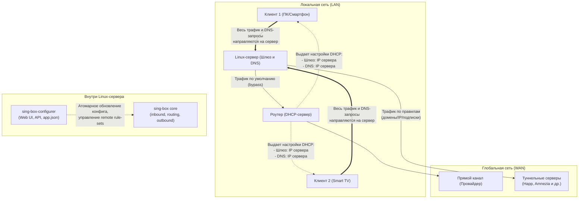

# Типовой вариант использования инструмента

```mermaid
graph TD
  subgraph LAN ["Локальная сеть (LAN)"]
    C1["Клиент 1 (ПК/Смартфон)"]
    C2["Клиент 2 (Smart TV)"]
    R["Роутер (DHCP-сервер)"]
    S["Linux-сервер (Шлюз и DNS)"]

    R -. "Выдает настройки DHCP:\n- Шлюз: IP сервера\n- DNS: IP сервера" .-> C1
    R -. "Выдает настройки DHCP:\n- Шлюз: IP сервера\n- DNS: IP сервера" .-> C2

    C1 ==>|"Весь трафик и DNS-запросы\nнаправляются на сервер"| S
    C2 ==>|"Весь трафик и DNS-запросы\nнаправляются на сервер"| S
  end

  subgraph ServerCore ["Внутри Linux-сервера"]
    CFG["sing-box-configurer\n(Web UI, API, app.json)"]
    CORE["sing-box core\n(inbound, routing, outbound)"]

    CFG -. "Атомарное обновление конфига,\nуправление remote rule-sets" .-> CORE
  end

  S ~~~ ServerCore

  subgraph WAN ["Глобальная сеть (WAN)"]
    ISP["Прямой канал (Провайдер)"]
    TUN["Туннельные серверы\n(Happ, Amnezia и др.)"]
  end

  S -- "Трафик по умолчанию (bypass)" --> R
  R --> ISP
  S -- "Трафик по правилам\n(домены/IP/подписки)" --> TUN
```

