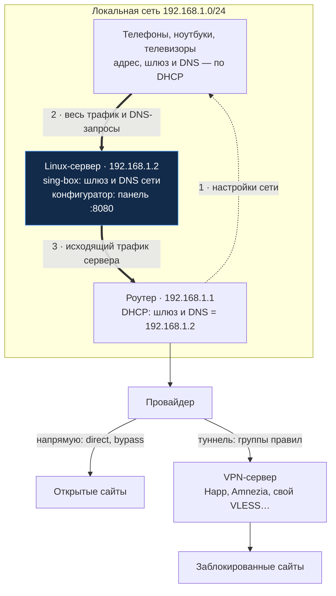
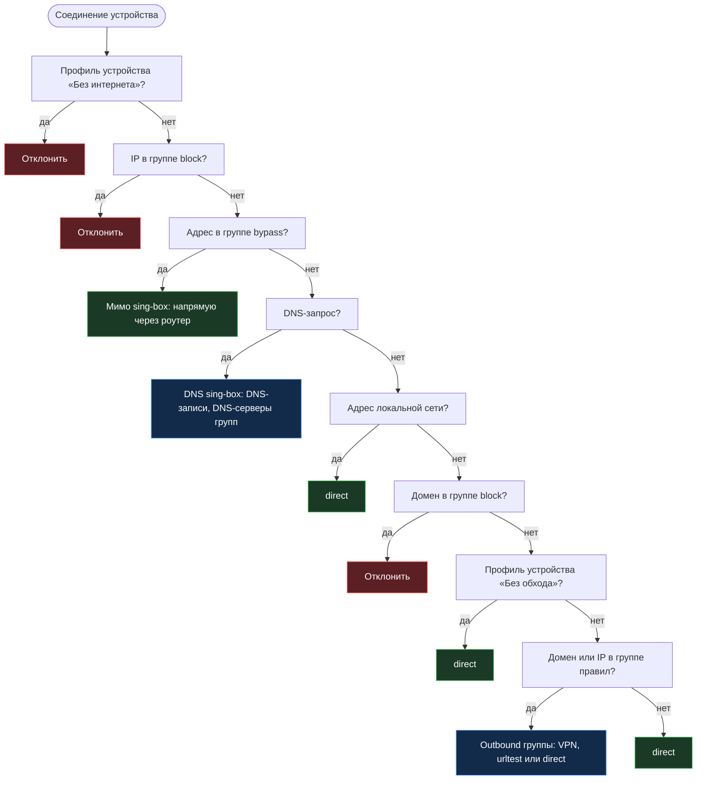

# Типовая схема использования

Конфигуратор и sing-box ставятся на Linux-сервер в локальной сети. Роутер раздает по DHCP адрес этого сервера
как шлюз по умолчанию и DNS-сервер, поэтому все устройства сети выходят в интернет через него. На сервере sing-box
решает, куда отправить каждое соединение: напрямую через провайдера, через VPN или никуда. Правила для этого
настраиваются в веб-панели конфигуратора.

Устройствам не нужны свои VPN-клиенты: телефоны, ноутбуки, телевизоры и приставки получают обход блокировок
автоматически, как только подключаются к сети.

## Схема сети



1. Роутер по DHCP выдает устройствам адрес, а шлюзом и DNS-сервером указывает Linux-сервер.
2. Устройства отправляют на сервер весь трафик в интернет и все DNS-запросы. sing-box перехватывает их
   прозрачным туннелем `tun-in` и DNS-сервером `dns-in` на порту 53.
3. Сервер сам выходит в интернет через роутер, как обычное устройство сети. Трафик через VPN уходит
   к VPN-серверу зашифрованным туннелем, остальной — напрямую.

Роутер продолжает раздавать адреса и работать с провайдером. Сервер должен быть в одной сети с устройствами
(в одном сегменте, без другого роутера между ними): по MAC-адресам из таблицы соседей работают профили
устройств.

## Что нужно

- **Linux-сервер** на amd64, arm64 или armv7: мини-ПК, одноплатник или виртуальная машина в той же сети,
  лучше подключенный к роутеру кабелем. Через него идет весь трафик сети, поэтому он должен работать постоянно.
- **Роутер, в котором можно задать шлюз и DNS для DHCP.** Это умеют OpenWrt, Keenetic, MikroTik и многие
  другие прошивки. Если роутер позволяет задать только DNS, выключите на нем DHCP и раздавайте адреса другим
  DHCP-сервером (например, dnsmasq на том же сервере) или задайте шлюз и DNS на устройствах вручную.
- **Outbound-ы для обхода**: подписка Happ, конфигурации Amnezia или свои серверы (share-ссылки VLESS, VMess,
  Shadowsocks, Trojan, Hysteria2, WireGuard).

## Установка по шагам

1. **Задайте серверу постоянный адрес вручную**, например `192.168.1.2/24`, шлюз `192.168.1.1`, DNS — роутер
   или провайдер (netplan, NetworkManager или `/etc/network/interfaces`). Получать адрес по DHCP сервер
   не должен: после шага 6 роутер выдал бы ему шлюзом его же адрес. Адрес выберите вне диапазона DHCP роутера.
2. **Включите пересылку пакетов**: сервер передает трафик других устройств. Docker включает ее сам, для установки
   через systemd выполните:

   ```bash
   echo 'net.ipv4.ip_forward = 1' | sudo tee /etc/sysctl.d/99-sing-box-gateway.conf && sudo sysctl --system
   ```

3. **Установите конфигуратор и sing-box** одной командой — [через Docker](install-docker.md) или
   [через systemd](install-systemd.md). sing-box займет порт 53: DNS-заглушку systemd-resolved скрипт отключит.
4. **Настройте маршрутизацию в панели** `http://192.168.1.2:8080`:
   - задайте логин и пароль в «Система → Безопасность»;
   - добавьте серверы на странице «Outbounds» или подписку в «Подписках»;
   - в «Правилах» заполните группы доменами и IP или источниками URL и выберите для каждой группы outbound;
   - примените конфиг на странице «Конфиг».
5. **Проверьте на одном устройстве**: укажите в его настройках сети шлюз и DNS `192.168.1.2` вручную. Сайты
   из групп должны открываться через VPN, остальные — напрямую. На странице «Соединения» видно, по какому правилу
   и через какой outbound ушло каждое соединение.
6. **Настройте DHCP роутера**: шлюз по умолчанию (option 3, router) и DNS-сервер (option 6) — `192.168.1.2`.
   Устройства получат новые настройки при переподключении к сети или продлении аренды адреса.
7. **Задайте профили устройств** на странице «Устройства»: найденным в сети устройствам можно оставить обход,
   пустить их напрямую или отключить от интернета, а для новых выбрать профиль по умолчанию. Устройства
   подписаны именами, которые конфигуратор узнает у роутера и у самих устройств, или производителем по MAC-адресу.

## Куда уходит соединение

sing-box проверяет правила по порядку. Первое подходящее правило решает, куда уйдет соединение.



- Домен соединения sing-box узнает из самого трафика (sniff: SNI для TLS, Host для HTTP), поэтому правила групп
  срабатывают, даже если устройство резолвит имена не через sing-box.
- Группы проверяются в порядке создания. Outbound группы можно переключать на лету на странице «Прокси».
- Группы с DNS-сервером резолвят свои домены через него: например, домены заблокированных сайтов — через DNS
  за VPN, чтобы провайдер не подменил ответ.
- Mixed-прокси (HTTP и SOCKS5) со страницы «Inbounds» — дополнительный вход для программ, которые умеют работать
  через прокси. Прокси с заданным «Выходом» отправляет весь свой трафик в выбранный outbound раньше всех правил
  этой схемы.

Порядок правил в итоговом конфиге и подробности о каждой группе — в [README](../README.md#архитектура).

## Если сервер недоступен

Пока сервер выключен, устройства остаются без интернета: их шлюз и DNS указывают на сервер. Чтобы быстро
вернуть сеть, верните в DHCP роутера его собственный адрес шлюзом и DNS-сервером и переподключите устройства.

- Обновление конфигуратора из интерфейса не останавливает sing-box. Применение конфига и плановая перезагрузка
  перезапускают sing-box на несколько секунд.
- Если роутер раздает IPv6, устройства могут ходить по IPv6 напрямую через роутер. DNS sing-box по умолчанию
  отдает только IPv4-адреса («DNS → Настройки»), поэтому сайты по доменам идут через сервер. Чтобы по IPv6
  через роутер не уходило вообще ничего, выключите IPv6 в локальной сети роутера.
- Устройства со своим DNS (частный DNS на Android, DoH в браузере) не используют DNS sing-box: группы
  для них работают по sniff, а DNS-серверы групп и DNS-записи — нет.
